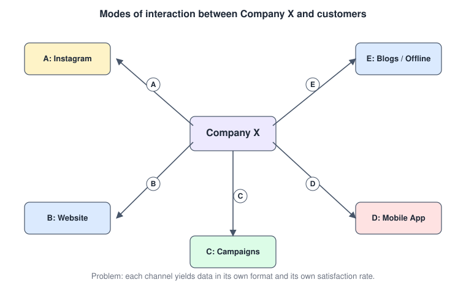
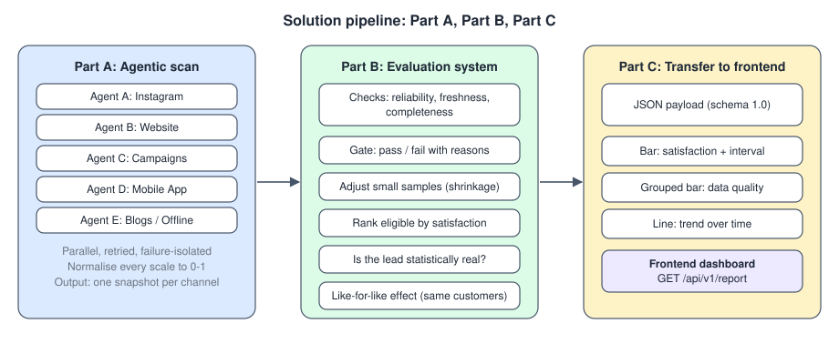
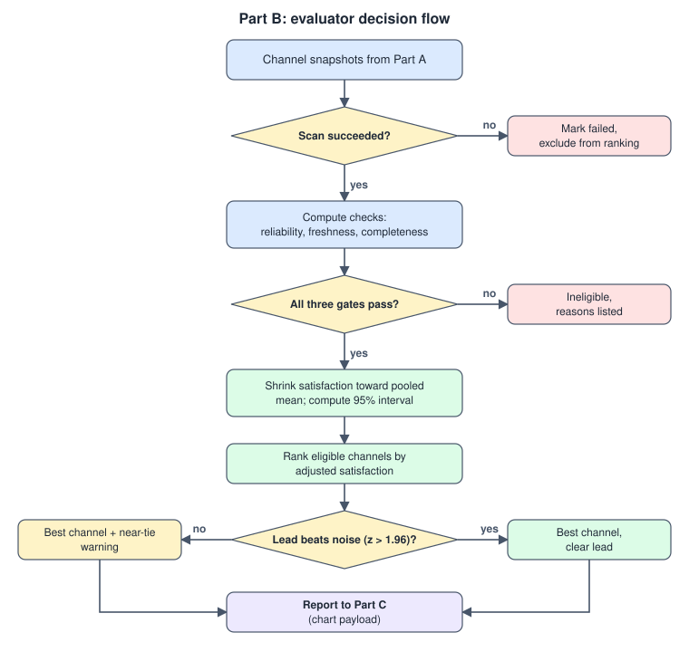
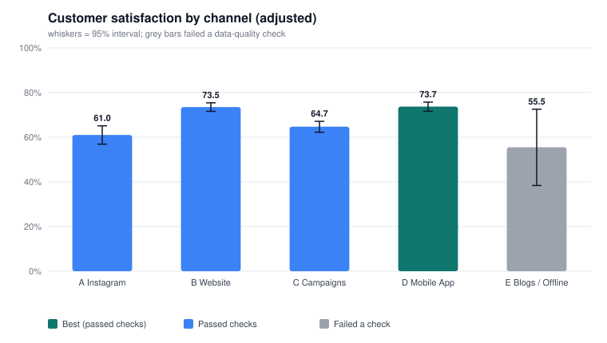

# Omnichannel Satisfaction Backend: Logic

Turns the handwritten proposal into a working core backend. Every step below maps to code in `omnichannel/`.

## 1. The problem and the proposal

Company X reaches customers through five channels. The data each channel produces, and the satisfaction rate it reports, differ from channel to channel.



| Code | Channel | Native satisfaction signal (assumed) |
|---|---|---|
| A | Instagram | Sentiment of comments (text, -1..1) |
| B | Website | 1-5 star survey |
| C | Campaigns | 0-10 NPS-style response |
| D | Mobile App | 1-5 in-app rating |
| E | Blogs / Offline branding | Thumbs up / down (0 or 1) |

The proposed solution has three parts:



| Part | Your note | Module |
|---|---|---|
| A | Agentic AI scans channels, gathers real-time data and the satisfaction rate per channel | `agents.py`, `sentiment.py`, `models.py` |
| B | Data comparing system: evaluate data through check parameters, treat the data with higher satisfaction as best | `evaluator.py` |
| C | Send data to the frontend in chart format | `presenter.py`, `api.py`, `svg.py` |

`pipeline.py` runs A, then B, then C. `simulation.py` supplies fake connectors with known ground truth so everything can run and be tested without real channel access.

## 2. Part A: channel agents

One `ChannelAgent` per channel. Each agent:

1. Calls its `Connector.fetch(since, until)` (the only piece you replace to use real data).
2. Applies a timeout and retries with exponential backoff (defaults: 10 s, 2 retries).
3. Normalises each record to one schema: satisfaction in 0..1, customer id, timestamp.
   - Numeric ratings: `(value - lo) / (hi - lo)`. Out-of-range values become `None`, never clamped, so they show up as incompleteness.
   - Text only (Instagram): a `SentimentScorer` returns -1..1, mapped to 0..1. The default is a small lexicon that returns `None` (unknown, not neutral) when no sentiment word is found. Swap in an LLM-based scorer by implementing `score(text) -> Optional[float]`.
4. Returns a `ChannelSnapshot`. Agents never raise: a dead channel returns `ok=False` with the error, so one outage does not stop the run.

`scan_all` runs all agents concurrently with `asyncio.gather`.

## 3. Part B: evaluation system



Your logic was: compare data through check parameters, then pick the data with higher satisfaction. The implementation keeps that two-stage shape (checks first, then rank) and adds guards against the ways ranking raw averages goes wrong (see `EVALUATION.md`).

### Stage 1: check parameters (data quality)

Let `k` = responses with a usable satisfaction value, `n` = all records from the channel.

| Check | Formula | Default gate |
|---|---|---|
| Reliability | `min(1, k / 30)` | need `k >= 30` |
| Freshness | `clip(1 - age_of_newest_record / 24h)` | need `>= 0.5` |
| Completeness | records with satisfaction, customer id and timestamp, divided by `n` | need `>= 0.8` |
| Quality score (reported) | `0.4*reliability + 0.3*freshness + 0.3*completeness` | not a gate |

A channel is **eligible** only if it passes all three gates. Failed scans are never eligible. Ineligible channels stay in the report with their reasons; they are simply not ranked.

### Stage 2: ranking on adjusted satisfaction

- Pooled mean `p` = mean satisfaction over all scored responses in all scanned channels.
- **Adjusted satisfaction** (shrinkage): `(k * raw_mean + m * p) / (k + m)` with `m = 20`. Small samples are pulled toward the pooled mean; large samples barely move.
- Standard error: `sd / sqrt(k + m)`; 95% interval = adjusted mean plus or minus `1.96 * se`.
- Eligible channels are ranked by adjusted satisfaction. The top one is `best_channel`.
- **Significance:** the lead counts as real only if `top - second > 1.96 * sqrt(se_top^2 + se_second^2)`. Otherwise the report says the lead is within noise.
- **Channel gap:** best minus worst eligible adjusted satisfaction, in points. Above 10 points the report flags inconsistent experience across channels. This ties the output back to the original problem.

### Like-for-like effect (diagnostic)

Different channels attract different customers, so a higher average may reflect who uses the channel. For customers seen in two or more channels, each channel's effect is that customer's mean in the channel minus their mean across channels, averaged over those customers (reported once at least 10 customers overlap). It is a diagnostic and does not change the ranking.

### Configuration

All thresholds live in `EvalConfig` (`evaluator.py`). Weights must sum to 1, otherwise construction fails.

## 4. Part C: transfer to the frontend

`GET /api/v1/report?days=14&bucket_days=1` returns one JSON document (`schema_version` `1.0`). All satisfaction values are percentages with one decimal; `null` means no data.

```jsonc
{
  "schema_version": "1.0",
  "generated_at": "...", "window": {"start": "...", "end": "..."},
  "summary": {
    "best_channel": {"key": "mobile_app", "code": "D", "label": "Mobile App"},  // or null
    "significant_lead": false,        // null if fewer than two eligible channels
    "channel_gap_points": 12.7,
    "pooled_satisfaction_pct": 68.8,
    "notes": ["..."]
  },
  "channels": [{
    "key": "website", "code": "B", "label": "Website", "status": "ok",
    "eligible": true, "rank": 2, "responses": 310, "scored_responses": 310,
    "raw_satisfaction_pct": 73.8, "adjusted_satisfaction_pct": 73.5,
    "ci_low_pct": 71.6, "ci_high_pct": 75.4, "like_for_like_effect_pts": 3.1,
    "data_quality": {"reliability_pct": 100.0, "freshness_pct": 97.7,
                     "completeness_pct": 100.0, "score_pct": 99.3},
    "reasons": []
  }],
  "charts": [
    {"id": "satisfaction_by_channel", "type": "bar", "x": ["A Instagram", "..."],
     "series": [{"name": "...", "data": [61.0, "..."]}],
     "error": {"low": [], "high": []}, "eligible": [], "highlight": 3},
    {"id": "data_quality_breakdown", "type": "grouped_bar", "x": [], "series": []},
    {"id": "satisfaction_trend", "type": "line", "x": ["2026-09-15", "..."], "series": []}
  ]
}
```

Chart entries are library-neutral: `x` plus `series[].data` map directly onto Chart.js `labels` and `datasets`, or Recharts data arrays. For each bar, `error.low` and `error.high` are the interval ends, `eligible` marks which bars to grey out, and `highlight` is the index of the best channel.

Other endpoints: `GET /health`, `GET /api/v1/channels`. CORS origins come from `OMNI_CORS_ORIGINS` (default `http://localhost:3000`).

`svg.py` renders the main chart server-side, for example for emails or reports:



## 5. Sample run (simulated data, 14 days)

| Channel | Scored | Raw % | Adjusted % | Eligible | Note |
|---|---:|---:|---:|---|---|
| A Instagram | 220 | 60.3 | 61.0 | yes | |
| B Website | 310 | 73.8 | 73.5 | yes | |
| C Campaigns | 131 | 64.0 | 64.7 | yes | 5% of records had no rating |
| D Mobile App | 260 | 74.0 | 73.7 | yes | best, but lead over Website is 0.2 pts (not significant) |
| E Blogs / Offline | 12 | 33.3 | 55.5 | no | 12 responses (needs 30); data stale |

Gap between best and worst eligible channel: 12.7 points, so the report flags inconsistent experience.

## 6. Running it

```bash
pip install -r requirements.txt
python -m omnichannel                      # writes sample_output/report.json + report_bar.svg
uvicorn omnichannel.api:app --reload       # serves the API on :8000
python -m pytest -q                        # 16 tests
python scripts/evaluate.py --seeds 300     # Monte-Carlo evaluation
python scripts/make_diagrams.py            # regenerates the SVG diagrams
```

## 7. Plugging in real channels

Implement one connector per channel and pass agents to the app:

```python
from omnichannel.agents import ChannelAgent
from omnichannel.api import create_app
from omnichannel.models import Channel, RawRecord

class WebsiteSurveyConnector:
    async def fetch(self, since, until):
        rows = await my_survey_api.list(since, until)          # your integration
        return [RawRecord(Channel.WEBSITE, r.user_id, r.created_at, score=r.stars) for r in rows]

app = create_app(lambda: [ChannelAgent(Channel.WEBSITE, WebsiteSurveyConnector()), ...])
```

Timestamps must be timezone-aware (UTC). For text channels, pass an LLM-backed `SentimentScorer` to the agent.
